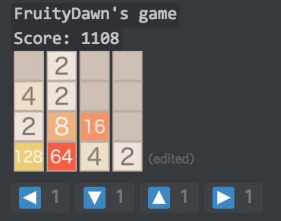
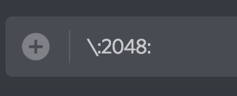
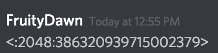
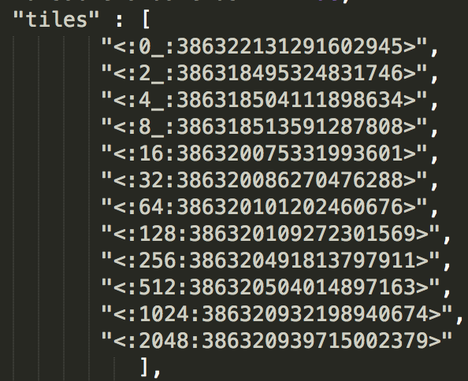

# Fruity 2048
A 2048 bot for discord.  

 
# Contents #
[Installation](#installation)  
[Commands](#commands)  
[Custom Tiles](#custom-tiles)

# Installation  
Make sure you have [node](https://nodejs.org/en/) installed.  
Clone/download this repo and navigate to it.  
```
npm install discord.js
```
  
Add your bot's client token to config.js.  

```
node 2048.js
```
  
# Commands  
**Help**: !2048 help  
**New game**: !2048 new  
**Continue game**: !2048 continue  
  
React to move, or use manual commands (!left, !right, !up, !down) if they are enabled.

# Custom Tiles  
To change from the default emojis offered by discord, upload your own emojis to your server. I've included the ones I made in /emojis if you'd like to use them.  
  
On your server, type a '\\' before each emoji to get its id:  
 
  
You should see something like this after you send it:  
  
  
Replace each element in the "tiles" array in config.json with its corresponding emoji id  (where each tile is given by 2^array_index):  
  

You can keep adding tiles (or have less tiles) over 2^11 (2048) - just make sure to change *MAXTILE* in game.js.


